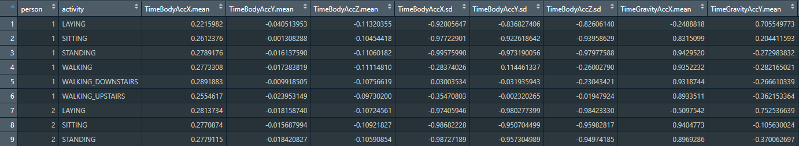

# SamsungSensorActivity
Tidy Dataset Project for 
[Course 3: Getting and Cleaning Data](https://www.coursera.org/learn/data-cleaning?specialization=jhu-data-science) in Johns Hopkins University's 
[Data Science Specialization](https://www.coursera.org/specializations/jhu-data-science#courses) in [Coursera](https://www.coursera.org/).

## Contents:
1. [Overview](#overview)
2. [Raw Data](#raw-data)
3. [R script](#r-script)
4. [Tidy Data](#tidy-data)
5. [Sources](#sources)

## Overview: 

The Tidy Dataset Project computes averages on mean and standard deviation measurements in the [Human Activity Recognition Using Smartphones Dataset](https://archive.ics.uci.edu/ml/datasets/human+activity+recognition+using+smartphones). 

The `TidyData.txt` dataset is the result of running the `tidydata.r` script, which performs these steps: 
1. Downloads the [Human Activity Recognition Using Smartphones Data Set](https://archive.ics.uci.edu/ml/datasets/human+activity+recognition+using+smartphones) from the UCI ML Repository
2. Sets up the directories and files, loads the data 
3. Merges the training and test sets
4. Extracts the mean and standard deviation for each measurement
5. Renames activities and variables using more descriptive labels 
6. Wrangles the data into tidy data format as per the principles laid out in [Hadley Wickham's paper.](https://vita.had.co.nz/papers/tidy-data.pdf)

The tidy dataset contains 180 instances of 2 labels and 79 features:
- Label 1: subject ID for each of the 30 participants in the experiment 
- Label 2: one of six activities performed by each subject
- 79 calculated variables, for each subject-activity pair, of mean, std and mean freq. measurements in the raw data


<figcaption><center><i>Tidy Dataset (head, few cols).</i></center></figcaption>

__Project Files__:
- `README.md`: describes project, analysis files and script
- `tidydata.r`: R script which performs the analysis and outputs a tidy dataset
- `TidyData.txt`: the tidy dataset produced by `tidydata.r`
- `CodeBook.md`: describes the data and the variables in the tidy dataset

Back to [Contents.](#contents)

## Raw Data:

The original project, Human Activity Recognition Using Smartphones Dataset, Version 1.0, was conducted by Jorge L. Reyes-Ortiz, Davide Anguita, Alessandro Ghio, Luca Oneto and Xavier Parra. It consists of strapping a smartphone around the waist of 30 volunteers who performed 6 activities (walking, walking upstairs and downstairs, sitting, standing and laying) and taking a variety of physical measures using the phone's embedded accelerometer and gyroscope. The obtained dataset was randomly partitioned into a training and test subsets with 70 and 30 percent of the data, respectively.

For a complete description and access to the original dataset, visit the [UCI Machine Learning Repository](http://archive.ics.uci.edu/ml/dataset). A video of the experiment can be seen on [YouTube](http://www.youtube.com/watch?v=XOEN9W05_4A). For more information about this dataset please contact: activityrecognition '@' smartlab.ws.

File structure:
- __UCI HAR Dataset/test/__
	+ `Inertial Signals`: a folder containing raw signals, not used * 
	+ `subject_test.txt`: subject id numbers (1-30), with 2947 obs.
	+ `X_test.txt`: the test data, with 2947 observations of 561 variables
	+ `y_test.txt`: activity labels for the test data (1-6), with 2947 obs.
- __UCI HAR Dataset/train/__ 
	+ `Inertial Signals`: a folder containing raw signals, not used * 
	+ `subject_train.txt`: subject id numbers (1-30), with 7352 obs.
	+ `X_train.txt`: the train data, with 7352 observations of 561 variables
	+ `y_train.txt`: activity labels for the train data (1-6), with 7352 obs.
- __UCI HAR Dataset/__
	+ `activity_labels.txt`: links the class labels with their activity name
	+ `features.txt`: list of all 561 variables 
	+ `features_info.txt`: info about the variables used on the feature vector
	+ `README.txt`: explains original project

 \* `Inertial Signals` folders do not contain any mean or std of any values, being comprised of files with raw signals, so they were not needed for the project, as per guidelines 

NOTES: 
1. The last six features of the original dataset, although labelled gravityMean, were not considered in the tidy dataset project since they represent averaging the signals in a signal window sample used on the *angle* variable (angle between vectors), and seem unecessary and not representative of more direct mean and standard deviation measures. 
2. All *mean* and *std* variables were selected, as well as the *meanFreq* variables (weighted average of the frequency components to obtain a mean frequency).

Back to [Contents.](#contents)

## R script:

The `tidydata.r` script was created using R version 3.4.2 on a x86_64-w64-mingw32 platform.  

### Running the script 

The script can be run as a standalone script via, given the appropriate folder structure. I setup my working directory to be "../GitHub/SamsungSensorActivity/":

```{r}
    source("./tidydata.r")
``` 

### Setup 

```{r}
# environment setup 
rm(list = ls())
options(scipen=999)

# install and load packages  
install_packages <- function(package){
    newpackage <- package[!(package %in% installed.packages()[, "Package"])]
    if (length(newpackage)) {
      suppressMessages(install.packages(newpackage, dependencies = TRUE))
    }
    sapply(package, require, character.only = TRUE)
}

packages <- c("dplyr")
suppressPackageStartupMessages(install_packages(packages))

# setup dir
setwd("../GitHub/SamsungSensorActivity/")
```

### Download raw data 

```{r}
# download if first time
if (!dir.exists("UCI HAR Dataset")) {
	URL <- paste0("http://archive.ics.uci.edu/ml/"
		     ,"machine-learning-databases/00240/"
		     ,"UCI%20HAR%20Dataset.zip")
	download.file(URL, destfile = "./smartphones.zip")
	# unzip and cleanup
	unzip(zipfile = "./smartphones.zip")
	unlink("smartphones.zip")
	unlink("./__MACOSX", recursive = TRUE)
}
```
	
### Load data

```{r}
setwd("./UCI HAR Dataset")
# train
subject_train <- read.table("./train/subject_train.txt")
y_train <- read.table("./train/y_train.txt")
X_train <- read.table("./train/X_train.txt")
# test
subject_test <- read.table("./test/subject_test.txt")
y_test <- read.table("./test/y_test.txt")
X_test <- read.table("./test/X_test.txt")
```

### Merge train and test sets

```{r}
X_train <- cbind(subject_train, y_train, X_train)
X_test <- cbind(subject_test, y_test, X_test)
X <- rbind(X_train, X_test)
```

The merged data has 10299 observations of 563 variables, with 2 added variables (subject and activity IDs) to the 561 features in the original data. There are 6 activities per subject and 30 subjects totalling 180 subject-activity pairs.

### Extract only measurements on the mean and standard deviation 

```{r}
features <- read.table("./features.txt")
datanames <- c("person", "activity", as.character(features$V2))
mean_features <- grepl("person|activity|mean()|std()|meanFreq()", datanames)
X_sub <- X[, mean_features == TRUE]
```

Subsets columns with `mean()`, `std()` and `meanFreq()` measures. The resulting data has 10299 observations of 81 variables (subject and activity IDs and 79 measurements).

### Rename labels and variables with descriptive names 

Load activity labels and cleanup names using regex.

```{r}
## rename with descriptive activity labels
activity_labels <- read.table("./activity_labels.txt")
X_sub[, 2] <- activity_labels[X_sub[, 2], 2]

## rename with descriptive variable names
x <- datanames[mean_features == TRUE]
x <- sub("tBody", "TimeBody", x)
x <- sub("tGravity", "TimeGravity", x)
x <- sub("fBody", "FreqBody", x)
x <- sub("BodyBody", "Body", x)
x <- sub("-mean\\(\\)-X", "X.mean", x)
x <- sub("-mean\\(\\)-Y", "Y.mean", x)
x <- sub("-mean\\(\\)-Z", "Z.mean", x)
x <- sub("-std\\(\\)-X", "X.sd", x)
x <- sub("-std\\(\\)-Y", "Y.sd", x)
x <- sub("-std\\(\\)-Z", "Z.sd", x)
x <- sub("-meanFreq\\(\\)-X", "X.meanFreq", x)
x <- sub("-meanFreq\\(\\)-Y", "Y.meanFreq", x)
x <- sub("-meanFreq\\(\\)-Z", "Z.meanFreq", x)
x <- sub("-mean\\(\\)", ".mean", x)
x <- sub("-std\\(\\)", ".sd", x)
x <- sub("-meanFreq\\(\\)", ".meanFreq", x)
names(X_sub) <- x
```

The resulting dataframe `X_sub` is organized by person-activity pairs, but since there are still multiple observations per pair, a final step is necessary.

### Create tidy dataset 
```{r}
# create independent tidy dataset with the mean of each variable 
# for each activity and each subject
library(dplyr, warn.conflicts = FALSE)
X_tidy <- X_sub %>%
	arrange(person, activity) %>%
	group_by(person, activity) %>%
	summarise_all(mean)
X_tidy <- as.data.frame(X_tidy)
```

Groups by person and activity before calculating the mean for each pair-feature observation.

Writes the dataframe into a text file for submission, in compliance with project guidelines:

```{r}
	write.table(X_tidy, file = "../TidyData.txt", row.name = FALSE, sep = " ")   	
```

Back to [Contents.](#contents)

## Tidy Data:

The resulting 'TidyData' dataframe in R and 'TidyData.txt' output in the working directory should be identical, and have 181 lines (a header and 180 observations) and 81 variables.

To read the tidy data back into R:

```{r}
    X <- read.table("./TidyData.txt", header = TRUE, stringsAsFactors = FALSE)
    View(X)
```    

The CodeBook.md further describes the tidy dataset and all of its variables.

## Sources:

I am indebted to David Hood for his [infamous tutorial](https://thoughtfulbloke.wordpress.com/2015/09/09/getting-and-cleaning-the-assignment) which helped me organize this project.

---